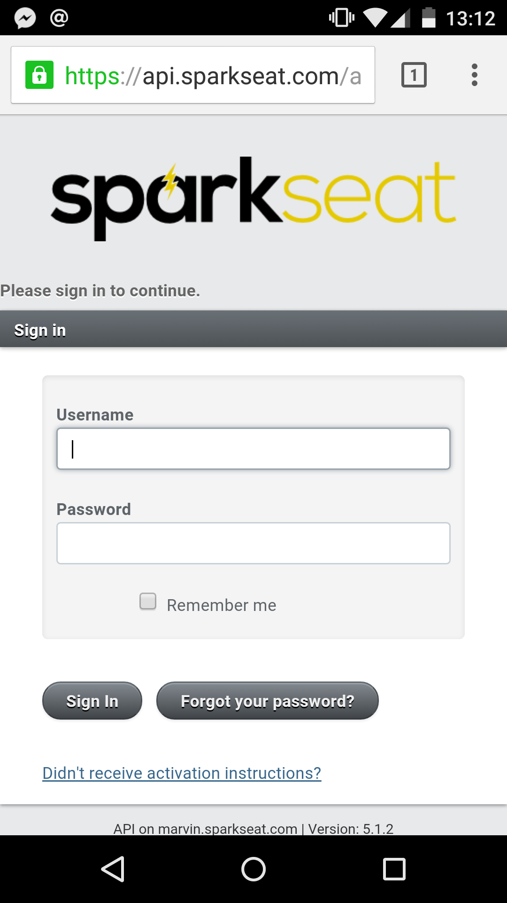
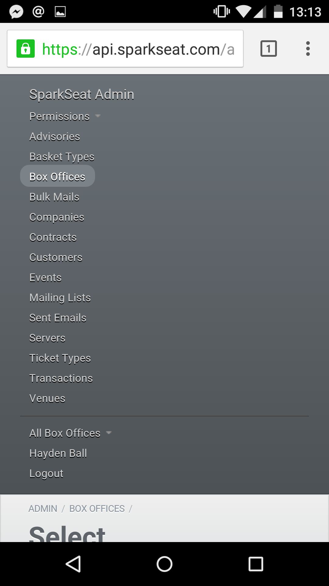
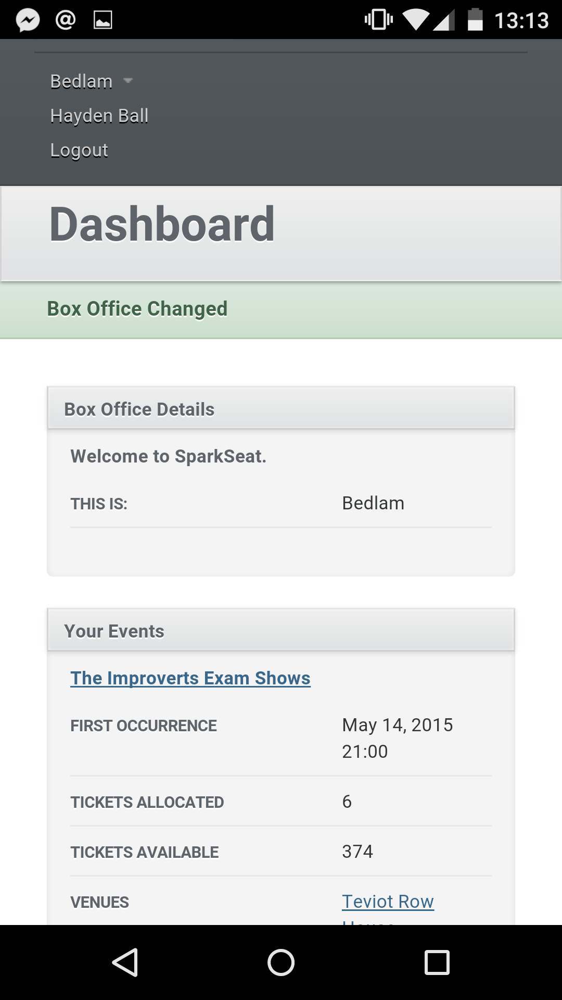
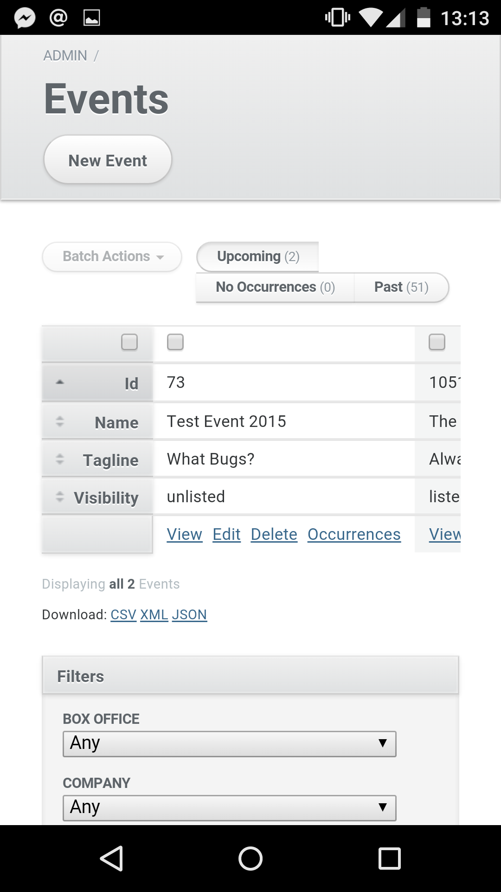
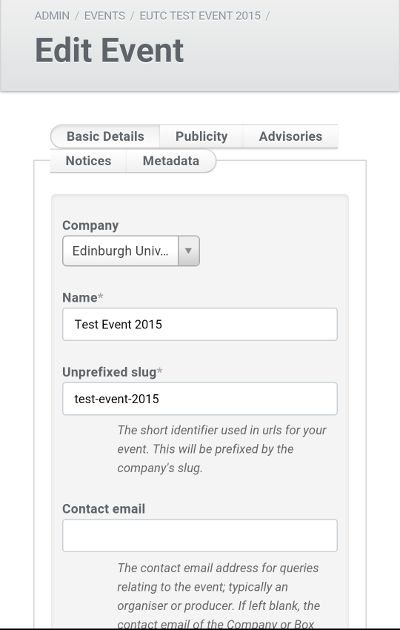

Responsive ActiveAdmin
======================

Responsive design for ActiveAdmin.

Released under the MIT-LICENSE.

Installation
------------

Add to your Gemfile

```ruby
gem 'responsive_active_admin'
```

In `app/assets/stylesheets/active_admin.css.scss`

```sass
  @import "responsive_active_admin"
```

Screenshots
-----------

The following were taken on my Nexus 5, of the [SparkSeat](https://www.sparkseat.com) activeadmin interface.

The login page:


Menu:


Dashboard / Show Page:


Index Page:


Form:

